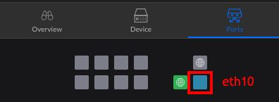
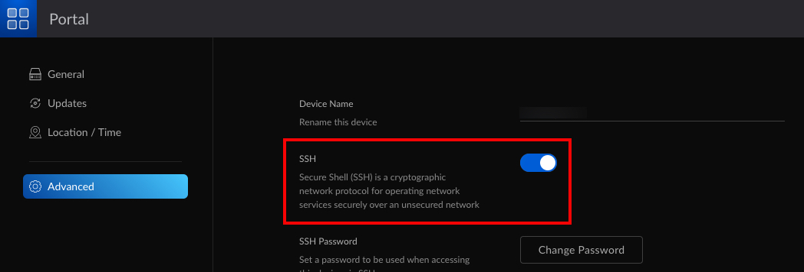

# Readme

## Features
Enable Jumbo Frames for all UniFi defined Networks on UDMP's LAN (eth10) SFP Port

## Compatability
Should work on any UDMP after 1.6.3

## Prerequisite
Enable SSH on your UDMP

## Steps

 1. SSH to your UDMP
 2. Download enableJumboFramesOnLanSfp.sh script
    - You can simply copy the script contents
 3. Set script to execute
    - chmod +x enableJumboFramesOnLanSfp.sh
 4. Execute
    - ./enableJumboFramesOnLanSfp.sh
 5. Test Jumbo Frames between networks

## Note
Jumbo Frame settings will not survive a UDMP reboot

Refer to https://github.com/boostchicken/udm-utilities/tree/master/on-boot-script#readme for instructions on how to setup UDMP Boot Script

Copy enableJumboFramesOnLanSfp.sh to the /mnt/data/on_boot.d folder of your UDMP

Reboot and Jumbo Frames will automatically be enabled with every UDMP boot